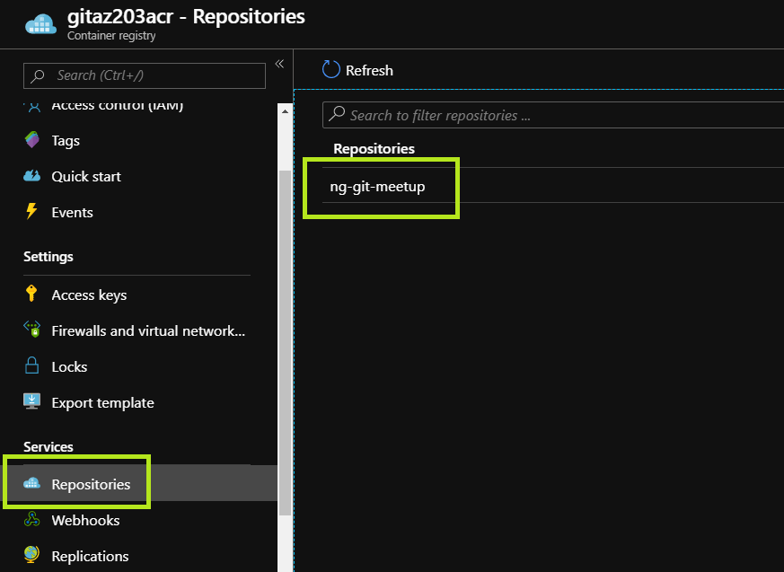

# Pushing an image to ACR


| Estimated time |
| -------------- |
| 15m            |

In this part of the exercise we will focus on pushing a docker container image to the ACR.

## Prequisites

In order to successfully build the project, Angular 8 is required.

<details>
<summary>Installing Angular 8 from scratch</summary>

In order to install Angular 8 from scratch, open your preferred shell and use the following command:

```bash
npm install --global @angular/cli
```

</details>

<details>
<summary>Upgrading to Angular 8 from an older version</summary>

```bash
npm uninstall --global angular-cli
npm uninstall --global @angular/cli
npm cache verify
npm cache clean
npm install --global @angular/cli
```

</details>

## Building the project

### Cloning the sample project solution

Open your preferred shell and use the following command to clone the solution repository:

```bash
git clone https://github.com/Girls-in-Tech-Poland/NgGirlsInTechMeetup
```

### Building the project solution using npm

Using your preferred shell, navigate to the source code folder, once inside, execute the following commands:

```bash
cd ng-git-meetup
npm install
npm run build
```

### Building the container image

Using your preferred shell, navigate to the source code folder, once inside, execute the following commands:

```bash
cd ng-git-meetup
docker build -t <acr-name>.azurecr.io/ng-git-meetup:latest .
```

### Pushing the container image to the ACR

<details>
<summary>Signing in to the ACR</summary>

Before pushing an image to the ACR, you will need to sign in, which is equivalent to a `docker login` operation.

```bash
az login
az acr login --name <acr-name>
```

</details>

After signing in, execute the following command to push your container image to the ACR

```bash
docker push <acr-name>.azurecr.io/ng-git-meetup:latest
```

<details>
<summary>Expected output</summary>

```
docker push gitaz203acr.azurecr.io/ng-git-meetup:latest
The push refers to repository [gitaz203acr.azurecr.io/ng-git-meetup]
cb3c5b4c0713: Pushing [==================================================>]  19.97MB
fbe0fc9bcf95: Pushing [==================================================>]  17.86MB
f1b5933fe4b5: Pushing [==================================================>]  5.796MB
```

</details>

### Verifying the results of docker push

- Navigate to the [Azure Portal](https://portal.azure.com) and access your resource group.
  
- Click on your ACR resource
- Click on **Repositories**
- Verify that `ng-git-meetup` container image is present in your registry's repository

## Conclusion

At this point, you should have a container image emited into the container registry. Please proceed to the [next step](./04.deploy-to-aks.md) of the lab.
