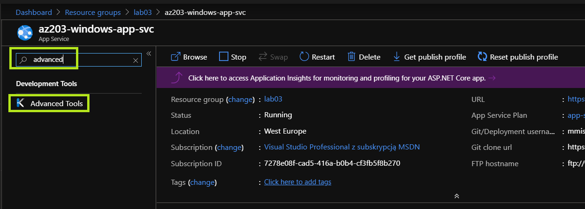
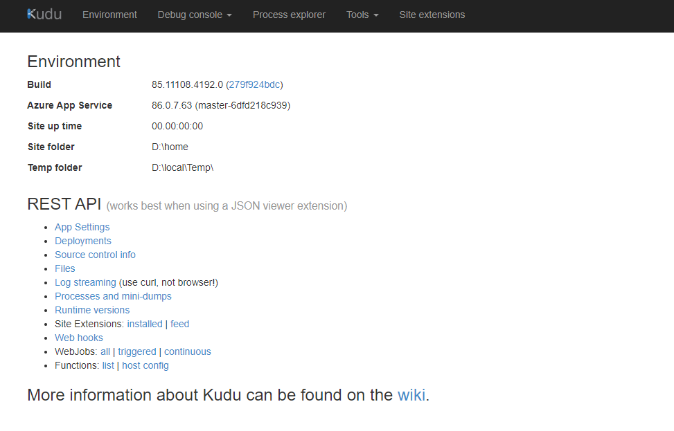

# Windows App Service

| App Service Plan                                | App Service                           |
| ----------------------------------------------- | ------------------------------------- |
|  |  |

|Estimated time|
|-|
30m|

## Provisioning the Windows App Service
### Provisioning the App Service Plan

- Create the Windows App Service plan using:
  ```bash
  az appservice plan create --name <app-service-plan-name> --resource-group <resource-group> --number-of-workers 1 --sku B2
  ```

### Provisioning the App Service
- Set the credentials for local git repo deployments
  ```bash
  az webapp deployment user set --user-name <username> --password <password>
  ```
  > **Params**
  >
  > - `<username>` - must be unique within Azure. Must not contain the `"@"` symbol
  > - `<password>` - at least 8 characters long, with two of the following three elements: letters, numbers, and symbols.

  

- Create the Windows App Service using:
  ```bash
  az webapp create \
      --plan <app-service-plan-name> \
      --resource-group <resource-group> \
      --name <app-service-name> \
      --deployment-local-git
  ```

  **Expected Response**
  The operation is expected to produce a JSON response similar to (Response below cleared for brevity):

  ```json
  {  
    "defaultHostName": "<app-service-name>.azurewebsites.net",
    "deploymentLocalGitUrl": "<git-deploy-url>",
    "enabled": true
  }
  ```

  > **Important**
  >
  > Please save the value of `<git-deploy-url>` in a separate location as it will be needed later.
  > Expected value should be similar to:
  > `https://<username>@<app-service-name>.scm.azurewebsites.net/<app-service-name>.git`

- Wait until provisioning is complete
- Using your preferred browser navigate to `htp://<app-service-name>.azurewebsites.net`
- Verify that the application is accessible and default page is displayed


## Deploying the application to an App Service

- Clone sample ASP.NET Core application using git.
  ```bash
  git clone https://github.com/Azure-Samples/
  dotnet-core-api
  ```
- Using your preferred commandline shell, navigate to the newly cloned repository
- Add a git repository "remote" named `azure`
  ```bash
  git remote add azure <deploymentLocalGitUrl-from-create-step>
  ```
- Deploy the application using git:
  ```bash
  git push azure master
  ```
- Wait for the deployment to complete
- Using your preferred browser navigate to `http://<app-service-name>.azurewebsites.net`
- Verify that the application is running

## Accessing Kudu

[Kudu](https://github.com/projectkudu/kudu) is the engine behind git/hg deployments, WebJobs, and various other features in Azure Web Sites. It can also run outside of Azure


- Open the [Azure Portal](https://portal.azure.com)
- Open your lab's resource group
- Open your app service
- Type `advanced` into the search bar
- Click on `Advanced Tools`


- You will be taken to `https://<app-service-name>.scm.azurewebsites.net` (it's ok to navigate there manually by pasting this address into the address bar of your preferred browser)

Kudu is a managing service available for every App Service on Azure. Operators can use Kudu for:
- Deploying apps
- Examining the applications' `ENVIRONMENT`
  - Examining system information
  - Examining ąpp settings
  - Examining connection strings
  - Examining all environment variables
  - Examining server variables
  - Examining HTTP headers
- Debugging running apps using `Debug console`
  - Examining the file system structure
  - Your application is deployed to `site/wwwroot`
- Examining running processes with the `Process Explorer`

> **Important**
>
> The `site/wwwroot` contains a `web.config` file. Any changes to that file will cause the application to be restarted

## Conclusion

In this part of the exercise we have demonstrated the windows app service's ability to host web applications deployed from a local git repository, and discussed [Kudu](https://github.com/projectkudu/kudu).

## (Try this at home) Configuration management

The `ASPNETCORE_ENVIRONMENT` environment variable is a way to tell the ASP.NET Core apps, using `Microsoft.Extensions.Configuration` which configuration to use. 

For local development this variable usually assumes the value of `Development`, however when hosting the application outside of our local development environment, we need to tell the app to build its configuration differently

- To set the `ASPNNETCORE_ENVIRONMENT` variable  
  ```bash
  az webapp config appsettings set --name <app-service-name> --resource-group <resource-group> --settings ASPNETCORE_ENVIRONMENT="Production"
  ```

## (Try this at home) Manual deployment

You can practice manual deployment using bonus content from [this repository](https://github.com/Girls-in-Tech-Poland/GirlsInTechApi).

### Further reading
- [ASP.NET](https://dotnet.microsoft.com/apps/aspnet)
- [Configuration in ASP.NET Core](https://docs.microsoft.com/en-us/aspnet/core/fundamentals/configuration/?view=aspnetcore-3.1)
- [App Service Documentation](https://docs.microsoft.com/en-us/azure/app-service/)
- [Local Git deployment to Azure App Service](https://docs.microsoft.com/en-us/azure/app-service/deploy-local-git)
- [Publish an ASP.NET Core app to Azure with Visual Studio](https://docs.microsoft.com/en-us/aspnet/core/tutorials/publish-to-azure-webapp-using-vs?view=aspnetcore-3.1)
- [Publish a Web app to Azure App Service using Visual Studio for Mac](https://docs.microsoft.com/en-us/visualstudio/mac/publish-app-svc)
- [Build an ASP.NET Core and SQL Database app in Azure App Service](https://docs.microsoft.com/en-us/azure/app-service/app-service-web-tutorial-dotnetcore-sqldb)
- [Continuous deployment to Azure with Visual Studio and Git with ASP.NET Core](https://docs.microsoft.com/en-us/aspnet/core/host-and-deploy/azure-apps/azure-continuous-deployment?view=aspnetcore-3.1)
