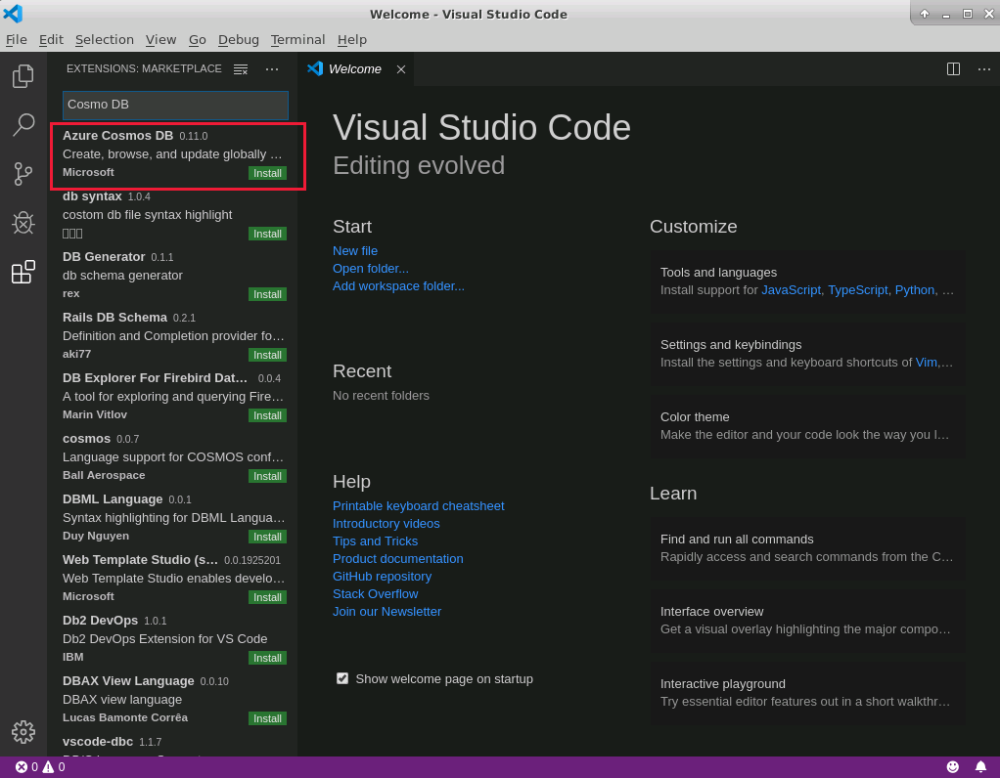
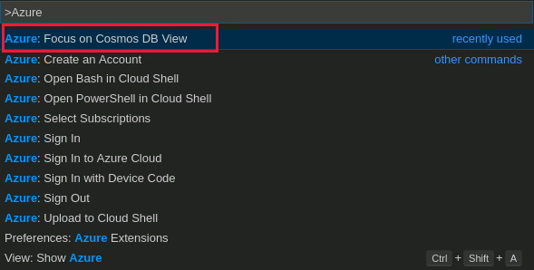
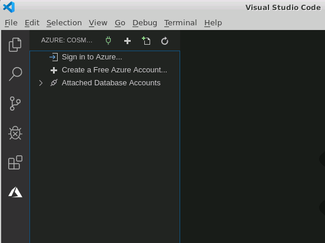
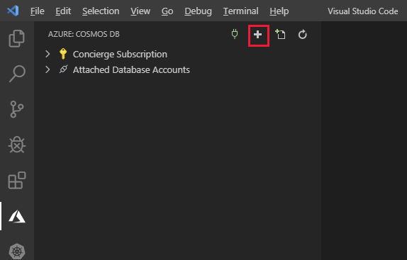
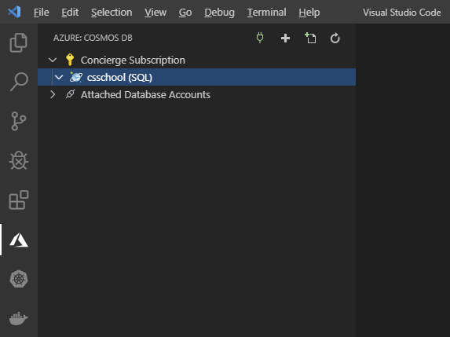
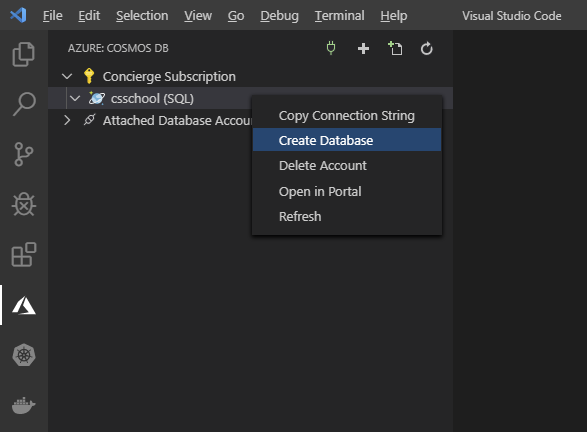
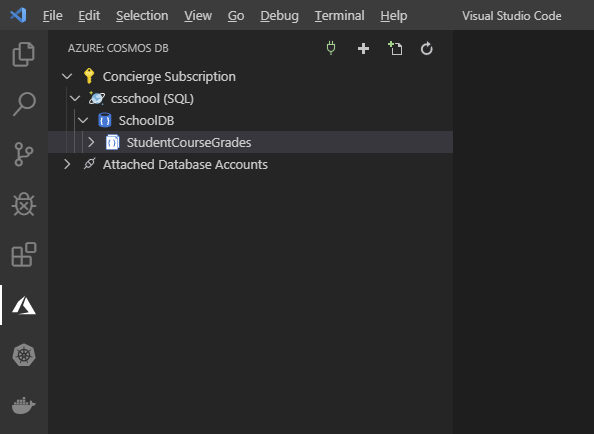
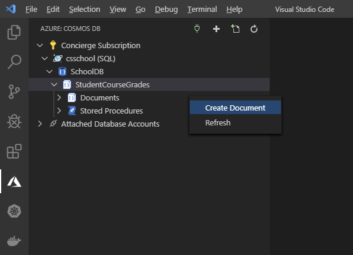
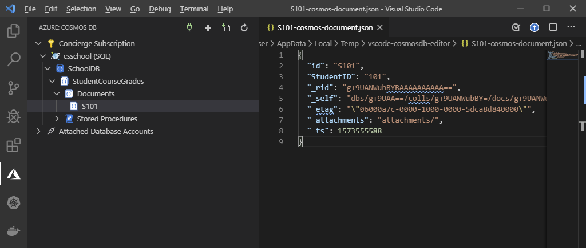
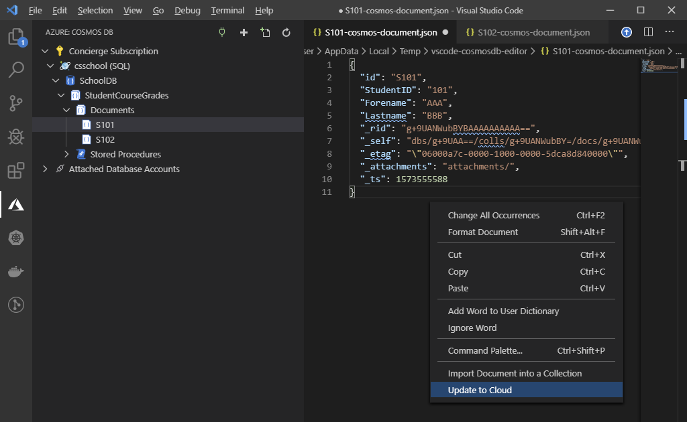

# Create a Cosmos DB instance using Visual Studio Code


| Estimated time |
| -------------- |
| 10 minutes     |

The Azure Cosmos DB extension enables you to create and manage Cosmos DB databases, containers, and documents from within VS Code.

In the sample scenario, you want to work within VS Code, both as a development environment for building applications, and as a tool for managing your Cosmos DB databases.

In this exercise, you'll install the Cosmos DB extension for VS Code. Then you'll use the extension to connect to your Azure account and create a Cosmos DB account. You'll add a database and container for holding students' course grade information to the Cosmos DB account. Finally, you'll create some test documents in the container, then view and update them.

# Install the Cosmos DB extension for Visual Studio Code

1. Start VS Code.
2. On the **View** menu, select **Extensions** to open the extensions pane.
3. In the **Search Extensions in Marketplace** box, type **Cosmos DB**, and press Enter.
4. In the list of extensions, select the **Azure Cosmos DB** extension published by Microsoft, and click **Install**.

5. Wait while the extension is installed.

# Create a Cosmos DB account

1. On the **View** menu, select **Command Palette**.
2. In the command palette, type **Azure**, and then select **Azure: Focus on Cosmos DB View**.

    
    The Azure Cosmos DB pane will appear.

    
3. In the Cosmos DB pane, click **Sign in to Azure**.
4. Sign in with the same credentials you used to set up the sandbox and then close the browser page.
5. In the toolbar above the Cosmos DB pane, click **Create Account** (the **+** sign).
   
    

    A wizard will start that prompts you for the details of the new account.
6. Select **You prefered subscription** from the "Select subscription" menu.
7. In the **Account name** box, enter an account name. The name must be globally unique; we suggest using something like **[your name or initials]school**.
8. In the **Select an API for your Cosmos DB account** list, select **SQL (DocumentDB)**.
9. In the **Select a resource group for new resources** list, select **+ Create new resource group** and provide a resource group name; we suggest using something like **[your name or initials]schoolRG**.
10. In the **Select a location for new resources** list, select a location near you.
11. Wait while the Cosmos DB account is created. This will take a few minutes.
12. When the account has been created, in the Cosmos DB pane, expand the Concierge Subscription. Verify that the new Cosmos DB account appears:

    

# Create a database and container

1. In the Cosmos DB pane, right-click the Cosmos DB account you created and then click **Create Database**.

2. In the **Database Name** box, type **SchoolDB**, and then press Enter.
3. In the **Enter an id for your collection** box, enter **StudentCourseGrades**, and then press Enter.
4. In the **Enter the partition key for the collection** box, type **StudentNumber**, and then press Enter.
   
   This container will hold `StudentCourseGrades` documents. Course grades will be held as an array of subdocuments with each student. The data will be partitioned by student ID.
5. In the **Initial throughput capacity** box, accept the default value of **1000**, and then press Enter.
6. Verify that the **SchoolDB** database, containing the **StudentCourseGrades** container, appears.


# Create and view documents

1. In the Cosmos DB pane, expand the **StudentCourseGrades** container. Two subfolders should appear, named **Documents** and **Stored Procedures**.
2. Right-click the **Documents** folder, and then click **Create Document**.

3. In the **Enter a document ID** box, type **S101**, and then press Enter. This will be the ID of a student document.
4. In the **Enter a value for the partition key** box, type **101**, and then press Enter.
    
    The document will be created and displayed in VS Code, in JSON format. The id and StudentNumber fields will be populated with the values you specified. The document will also contain other fields that are added automatically by Cosmos DB for its own internal use.

5. In the Cosmos DB pane, right-click the **Documents** folder again, and then click **Create Document**.
6. In the **Enter a document ID** box, type **S102**, and then press Enter. This will be the ID of another student.
7. In the **Enter a value for the partition key** box, type **102**, and then press Enter.

    The new document will appear.

# Edit documents

1. In the **Documents** list, select the **S101** document.
2. In the JSON document that appears, move to the end of the **StudentNumber** line, and press Enter.
3. Add the following fields to the document. Don't forget to add a comma at the end of each line:
    ```json
    "Forename": "AAA",
    "Lastname": "BBB",
    ```
4. Right-click anywhere in the document pane, and then click **Update to Cloud**.

    The document will be written back to Cosmos DB. The VS Code log window will appear. The final message in the log should be similar to the following example:

    ```text
    10:51:56: Updated entity "csschool (SQL)/SchoolDB/StudentCourseGrades/Documents/S101"
    ```
5. In the **Documents** list, select the **S102** document.
6. Add the following fields to the document after the **StudentNumber** field, and then save the updated document to the cloud:
    ```json
    "Forename": "CCC",
    "Lastname": "DDD",
    ```
7. In the Documents list, select the **S101** document again.
8. Add the following field to the document, after the **Lastname** field:
    ```json
    "CourseGrades": [
        {
            "Course": "Computer Science",
            "Grade": "A"
        },
        {
            "Course": "Applied Mathematics",
            "Grade": "B"
        }
    ],
    ```
    This is an array field that contains the grades for each course that the student has taken. Each pair of Course/Grade fields is a subdocument. Using an array makes it possible to record the details of a variable number of courses for each student.
9. Save the updated document to the cloud.
10. Edit the **S102** document, add the following fields, and save the updated document to the cloud:
    ```json
    "CourseGrades": [
        {
            "Course": "Computer Science",
            "Grade": "C"
        }
    ],
    ```
    This student has only taken the Computer Science course.

You've now used the Cosmos DB extension in VS Code to create a Cosmos DB database and container. You've added and viewed documents, and you've edited these documents.