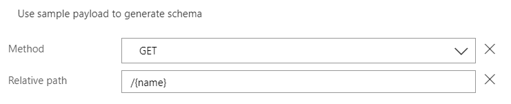
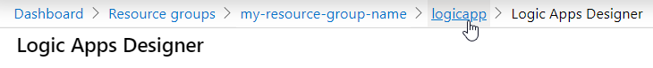
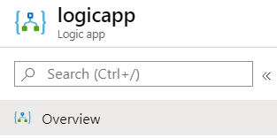
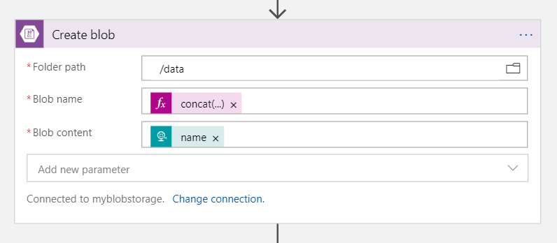

# Lab05 - Azure Logic Apps

| Azure Logic Appps | 
| ----------------------------------------------- | 
|  | 

This lab aims to provide a hands-on experience in
deploying applications to Azure App Services running on both Linux and Windows operating systems.

### Table of Contents

The exercise is divided into the following parts:

| Part no. | Title                                                                           | Expected Duration 
| -------- | ------------------------------------------------------------------------------- | ----------------- 
| 1        | Creating web services using Logic Apps                                          | 10m               
| 2        | Parametrizing Logic Apps                                                        | 10m               
| 3        | Monitoring Logic Apps                                                           | 7m               
| 4        | Logic Apps built-in versioning                                                  | 3m               
| 5        | Integration with Blob Storage                                                   | 15m               

## Scenario 1 - Creating web services using Logic Apps

1. Ceate **New Resource**.  

2. Search for **Logic Apps**.  

3. Click **Create**.  

4. Fill the form.  

   - **Name**: Http-Request-App
   - **Subscription**: leave default value
   - **Resource group**: Choose lab05 resource group
   - **Region**: North Europe
5. Click **Create**. 
6. Open created logic app.
   1. Either by opening from notification center by clicking **Go to resource**, or  
   
   1. Go to lab05 resource group and selecting your logic app  
   
7. Select **blank logic app** template.  

8. Search for **Request** trigger and select it.  

9. Choose **When a HTTP request is received** trigger.  

10. Change **method** to **GET**.  
  

11. Add **New Step**.  

12. Choose **Request** from recent.  

13. Select **Response** action.   

14. **Save** the logic app.  

15. **Run** the logic app.   
.
16. Result should look as presented.  

17. Go back to **Designer**.  

18. Add **Hello world!** to response body.  

19. **Save** the logic app.  

20. Copy request URL from the trigger step.  

21. Paste it in new browser URL window.  


### Scenario 1 summary

> Logic Apps are amazing ways to visually create business workflows as well as cross-service integrations. They are in fact called **Enterprise Integration Service**. It's basically coding using visual building blocks.

> In this example you have built a simple web service which takes no parameters and returns simple 

## Scenario 2 - Parametrizing Logic Apps

1. Go back to **Designer**.
2. Add **relative path parameter**.  

2. Set the value of relative path to **/{name}**.  

2. Save the logic app.  

    > New logic app dynamic parameter is now available to use after saving the logic app. 
2. Replace text **Hello world!** in the output by removing **world** word and while having cursor in the place of that word clicking on **name parameter**.  

2. Paramterized output should look like this.  

2. Save the logic app.  

2. Copy newly generated URL and paste it in the browser.  

    > URL changed because we added parameters which affect how URL looks like.
2. Replace **{name}** (with the brackets) with your name and press enter.  


## Scenario 3 - Monitoring Logic Apps

1. Go to logic app oerview page.  

2. And hit **Refresh** button.  

3. Review Logic App **run history** and click on the most recent run.  

4. Check the successful run and **click** on the **Request**.  

5. Review input and output values.  

6. Review input and output values for **Response**.  


> Logic Apps montoring is one of the its best features. You can review every single step, check inputs and output for each step. This feature also very easily allows for debugging.

1. Click resubmit run to run logic app using the same parameters.  
  
  

2. Check results of resubmitted run.
3. Review logic app results.

> With Resubmit feature it is also very easy to rerun failed runs or test your logic apps. They will be resubmitted using the same input as the run you selected.

## Scenario 4 - Logic Apps built-in versioning

1. Go to **Versions** blade.  

3. Select any version to to review previous logic app versions.  

2. Go back to **Overview** blade.  


> When developing logic apps Azure saves by default every version. Unfortunately there is currently no out of the box integration with git but you can later do full CI/CD with Azure DevOps using ARM templates.

## Scenario 5 - Integration with Blob Storage

1. Run the **Azure CLI** to create new storage account. Replace values with your name and resource group.
   > Name for storage account must be globally unique so make sure it's not common name.
   ```bash
    az storage account create \
        --name <name>  \
        --resource-group <resource_group_name>  \
        --location northeurope  \
        --sku Standard_LRS  \
        --kind StorageV2
    ```
    or with one liner
    ```bash
    az storage account create --name <name> --resource-group <resource_group_name> --location northeurope --sku Standard_LRS --kind StorageV2
    ```
2. Create Storage Container for data
    ```bash
    az storage container create --name data --account-name <name>
    ```
3. Go to Logic App **Designer**.  
4. **Add an action** between steps.  

1. Search for **blob** and select **Azure Blob Storage** connector.  

1. Select **Create blob** action.  

1. Create new connection.  
    1. Pick any name you want.
    2. .Select your storage account and hit **Create**.  
    
1. In **Folder name*8 field select folder picker.  

1. Choose data container.  

1. Click in **Blob name** file, select **Expression** in the popup and paste in the expression and clikc **OK**.  
    ```json
    concat('request-',guid(),'.txt')
    ```
    
1. In **Blob content** click on the text field and select **See more** in the popup.  

1. Select **name** parameter.  

1. Blob connector setting should look like this.

3. Save the logic app.  


### The logic app

1. Grab the URL of logic app from the trigger element. 

1. Test it in the browser using several names of your choice.  

1. Go to **resource group**.  

1. Open storage account. In case you don't see it hit **Refresh** button on the top.  

1. Go to **containers**.  

1. Open **data** container.  

1. Validate multiple files are in the storage and click on one of them.  

1. Hit **Edit** tab and validate contents. You should see name passed in the URL.  


> You have successfully created a web service which accepts parameters, connects to blob storage and saves data permanently and responds using those parameters. Now take advantage of those 200+ connectors.